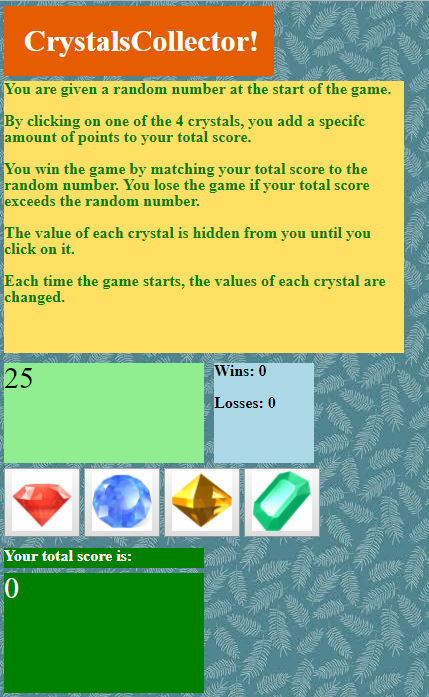

In this interactive game for web browswers, users click the four crytstal icons to add points to their score. The point value of each crystal is hidden from users until the crystal is clicked. Users win the game by matching their score to the random number that is automatically generated and displayed on the screen when the game starts. 

The number of game wins and losses is tallied and displayed on the screen. Each time a new game starts, a new random number is generated, and the crystal icons are assigned new points.

The following image shows the application:

# Tools Used

- html and css
- jQuery
- JavaScript
